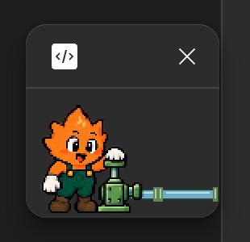

# FigmaSpark

Быстрый локальный канал между **живым макетом Figma и ИИ-агентом**. Агент получает обзор страниц и экранов, находит нужную область и сверяет её с документацией. Маленькая пиксельная искра показывает связь и трафик без текста.

**Figma Desktop · Node.js 22+ · Codex / Cursor / Claude Code · без стандартного Figma MCP**



Содержимое плагина — **120 × 80 px**. Внутри только маскот, насос и труба. На скриншоте видна также штатная оболочка окна Figma; её рамка и закрытие управляются самой Figma.

## Подключиться через ИИ

### Плагин уже работает

1. Запустите FigmaSpark в нужном Design-файле.
2. Нажмите на искру.
3. Вставьте скопированный текст в чат локального ИИ-агента, затем добавьте задачу и документацию.

В буфер попадает короткая инструкция со ссылкой вида:

```text
http://127.0.0.1:3847/connect?session=SESSION_ID
```

По ссылке агент получает актуальную инструкцию, адрес скилла, локальные пути к CLI и установщику и выбранную сессию. Сам текст скилла отдаётся этим же сервисом. Если скилла нет, агент может установить его в редактор пользователя. Данные макета запрашиваются отдельно с локальной авторизацией; ссылка не содержит ключей доступа.

### Установить с нуля

Вставьте в чат ИИ-редактора:

```text
Установи FigmaSpark из https://github.com/KindWizzard/FigmaSpark на этом компьютере.
Прочитай README и docs/installation-ai.md. Подготовь локальный сервис,
собери и импортируй плагин в Figma Desktop, установи скилл figma-spark
в мой текущий ИИ-редактор и проверь связь на отдельном тестовом файле.
Если нужен мой шаг в Figma, сначала подготовь всё остальное и объясни этот шаг.
После подключения начни с обзора макета, затем читай только нужные области.
```

[Полная инструкция для агента](docs/installation-ai.md). Для доступа к этому каналу агенту нужен локальный инструмент работы с файлами и HTTP; cloud-agent на другом компьютере не видит ваш `localhost`.

## Ручная установка

1. Установите [Node.js 22 или новее](https://nodejs.org/en/download) и Figma Desktop. Склонируйте проект:

   ```sh
   git clone https://github.com/KindWizzard/FigmaSpark.git
   cd FigmaSpark
   npm ci
   ```

2. В Figma Desktop создайте свою регистрацию: **Plugins → Development → New plugin**. Выберите Figma Design и вариант с UI. Сохраните предложенную Figma папку и найдите `id` в её `manifest.json`. ID назначает Figma; это [официальный порядок регистрации](https://developers.figma.com/docs/plugins/manifest/).

3. Подготовьте FigmaSpark, подставив полученный ID:

   ```sh
   npm run setup -- --plugin-id YOUR_FIGMA_PLUGIN_ID
   ```

   Вместо копирования ID можно передать путь к созданному Figma файлу:

   ```sh
   npm run setup -- --manifest "/path/to/figma-created/manifest.json"
   ```

   Установщик создаст локальную конфигурацию, `plugin/manifest.json` и сборку. Эти файлы генерируются для вашего компьютера и не публикуются в Git.

4. Импортируйте **именно `FigmaSpark/plugin/manifest.json`** через **Plugins → Development → Import plugin from manifest…**. Новая регистрация должна указывать на код FigmaSpark, а не на пример из папки, созданной Figma.
5. Запустите сервис и оставьте его работающим:

   ```sh
   npm start
   ```

   На macOS также можно открыть `Start FigmaSpark.command`.
6. Откройте нужный Design-файл и запустите **FigmaSpark → Подключиться**. Искра автоматически соединится с локальным сервисом.
7. Установите скилл в свой редактор:

   ```sh
   npm run install-skill -- --editor codex
   # Или --editor cursor / --editor claude
   ```

8. Нажмите на маскота, вставьте инструкцию в чат и попросите получить обзор. Отдельная проверка:

   ```sh
   node scripts/spark.mjs connect http://127.0.0.1:3847/connect
   node scripts/spark.mjs status
   ```

Не закрывайте сервис и плагин во время работы агента. Если скилл не появился, перезагрузите редактор.

## Установка скилла в редактор

| Редактор | Папка новой установки | Команда |
| --- | --- | --- |
| Codex | `~/.agents/skills/figma-spark` | `npm run install-skill -- --editor codex` |
| Cursor | `~/.cursor/skills/figma-spark` | `npm run install-skill -- --editor cursor` |
| Claude Code | `~/.claude/skills/figma-spark` | `npm run install-skill -- --editor claude` |
| Другой редактор с Agent Skills | Поддерживаемая им папка | `npm run install-skill -- --dest "/path/to/skills/figma-spark"` |

Расположение скиллов описано в документации [Codex](https://learn.chatgpt.com/docs/build-skills), [Cursor](https://prod.cursor.com/docs/skills) и [Claude Code](https://code.claude.com/docs/en/skills). Скилл работает с локальным bridge и не включает Figma access token или настройки MCP.

Установщик отказывается перезаписывать существующую папку без `--update`. При обновлении её копия сохраняется в `.runtime/skill-backups/`; путь выводится в результате установки. Для ранее установленного скилла в другой папке используйте `--dest`. Настройки редактора и его другие скиллы не меняются.

```sh
npm run install-skill -- --editor codex --update
```

## Возможности

| Возможность | Что получает агент |
| --- | --- |
| Обзор | Имена и IDs всех страниц; разделы, экраны, группы и короткие текстовые подсказки выбранной страницы |
| Поиск | Имена страниц либо названия и текст слоёв в заданной странице или фрейме |
| Компактное чтение | Реальный текст, геометрия, layout, стили, привязки variables, variants и instance overrides; порции по 100 слоёв |
| UI-библиотека | Определения использованных компонентов, объединённые по ключу; локальные styles и коллекции variables |
| Визуальная проверка | PNG/JPG/SVG нужных экранов, подробные свойства отдельных слоёв, CSS и prototype reactions по запросу |
| Сверка с ТЗ | Измеримые правила через `audit`; замечания агента через `report`; источник требования, node IDs и статус `pass / fail / unknown` |
| Навигация | Выделить и приблизить слой или открыть нужную страницу |
| Разрешённые правки | Ограниченный `patch` с проверкой ожидаемых значений, отдельным разрешением в меню Figma и Undo |
| Несколько файлов | Отдельные сессии; явный выбор файла для каждого запроса |

Обзор учитывает разные способы организации макета: sections, вложенные группы, экземпляры и отдельные заметки. Имена вроде `Frame 42` дополняются короткими примерами текста. Обзор не требует заранее выгрузить весь файл.

## Почему это экономит время и данные

- Постоянный WebSocket ведёт непосредственно к Plugin API. Не нужен стандартный MCP, access token Figma или отдельный облачный relay.
- Сначала маленький обзор, затем поиск и конкретные node IDs. Изображения и дорогие свойства загружаются по необходимости.
- Компактный snapshot сохраняет данные для проверки, не разрешая каждый main component и каждый фрагмент форматированного текста.
- Общие определения компонентов читаются один раз; собственный текст, варианты и overrides экземпляров остаются видны.
- Обходы и результаты кэшируются. Изменения отслеживаемых страниц и стилей сбрасывают кэш; `--refresh` принудительно перечитывает данные.
- JSON не требует отдельного бинарного кодека. Сообщения от 4 KiB сжимаются через WebSocket deflate и HTTP gzip с быстрым уровнем сжатия.
- Один процесс CLI-клиента можно переиспользовать для серии запросов, исключив повторные запуски CLI. Первая попытка переподключения плагина — через 250 мс, задержка ограничена 2 с.

В локальной проверке живого большого макета обзор занимал 113,7 мс, повтор из кэша — 2,3 мс. Компактное описание тех же 1000 слоёв было на 48% меньше полного JSON. Это измерения отдельного запуска; время зависит от файла и Figma. Сравнения со стандартным MCP не проводилось. [Условия проверки](docs/verification.md).

## Как это работает


Схема доступна в [SVG](docs/media/architecture.svg) и [PNG](docs/media/architecture.png), оба файла имеют прозрачный фон.

Локальный **Node.js bridge** хостит инструкцию `/connect` и файлы скилла. UI плагина поддерживает постоянный WebSocket, а sandbox плагина обращается к Figma Plugin API. Агент использует HTTP JSON с локальным Bearer token, читая его из конфигурации; ключи не копируются в чат.

Публичные локальные маршруты `/health`, `/connect` и `/skills/figma-spark/*` отдают только состояние сервиса и инструкции. `/status`, `/rpc` и технический preview требуют авторизации. Сервис слушает только loopback, проверяет Host и источник WebSocket. `.runtime/connection.json` хранится с правами 0600. Сессии, таймауты, отмена и лимиты очереди ограничивают маршрутизацию запросов.

[Описание HTTP, протокола и структуры проекта](docs/architecture.md).

## Маскот

Нет связи — искра дремлет, труба разъединена. Есть связь — моргает и иногда машет. Запросы идут — качает насос, по трубе движутся шары; их количество связано с объёмом реальных сообщений. Ошибка — удивляется и показывает застрявший шар. Клик копирует локальную инструкцию и подтверждается жестом. Поддерживается reduced motion.

Внутри UI нет собственных рамок, надписей и кнопок. Внешняя оболочка окна остаётся: публичный [showUI API](https://developers.figma.com/docs/plugins/api/properties/figma-showui/) её не отключает. [Спрайты](assets/mascot/pixel-spark-sprites-v1.png) содержат 16 кадров на прозрачном фоне; [параметры и промпт](assets/mascot/manifest.json) и [ранние концепты](assets/concepts/) сохранены в проекте.

## Примеры работы

```sh
node scripts/spark.mjs overview --session SESSION_ID
node scripts/spark.mjs search "Players" --scope file --session SESSION_ID
node scripts/spark.mjs overview --page PAGE_ID --session SESSION_ID
node scripts/spark.mjs search "Apply" --nodes FRAME_ID --session SESSION_ID
node scripts/spark.mjs snapshot --nodes FRAME_ID --out output/snapshot.json --session SESSION_ID
node scripts/spark.mjs libraries --nodes FRAME_ID --session SESSION_ID
node scripts/spark.mjs capture --nodes FRAME_ID --out output/capture --session SESSION_ID
node scripts/spark.mjs audit --input examples/test-rules.json --out output/review.json --session SESSION_ID
node scripts/spark.mjs focus --nodes NODE_ID --session SESSION_ID
```

IDs в примерах условные. При нескольких файлах `--session` обязателен. Можно передавать скопированную ссылку через `--connect LOCAL_URL`, чтобы автоматически выбрать указанную живую сессию. [Справочник команд, правил и правок](skills/figma-spark/references/api.md).

## Ограничения и обновление

Нужны открытый Design-файл, работающий локальный сервис и плагин. Закрытый плагин не читает файл. Каталог содержит использованные определения компонентов, а не все удалённые библиотеки. Большие выборки имеют лимиты и пагинацию: проверяйте `coverage` и `nextOffset`. Неполные данные не подтверждают отсутствие элемента. Статический макет не подтверждает работу приложения.

При ошибке `PAGE_UNAVAILABLE` откройте нужную страницу через `focus --page ID` и повторите чтение. Уже загруженная страница читается без нового сетевого запроса к Figma.

Для обновления исходников: `git pull`, `npm ci`, `npm run build`; затем перезапустите локальный сервис и плагин, обновите скилл с `--update`. После пересоздания конфигурации также пересоберите плагин. Сборка содержит ваш локальный pairing code, поэтому `plugin/dist`, `.runtime`, сгенерированный manifest и выгрузки макетов исключены из Git.

Для разработки: **`npm run check`** — TypeScript, сборка и тесты. [Результаты проверки](docs/verification.md). Код и оригинальные ассеты распространяются по [MIT License](LICENSE).
