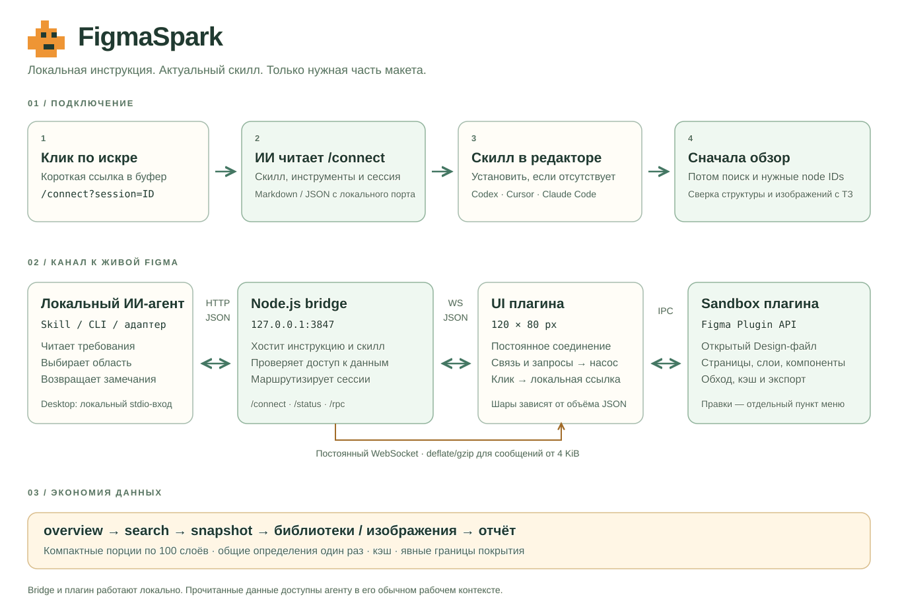

# Архитектура FigmaSpark



## Первый контакт

Клик по маскоту копирует короткий запрос к ИИ и URL `/connect?session=ID`. Адрес приходит от bridge после аутентифицированного WebSocket handshake, поэтому указывает на сессию именно этого экземпляра плагина. При отсутствии связи копируется общий `/connect` из параметров локальной сборки.

Bridge отдаёт актуальный Markdown с инструкцией либо JSON при `format=json`. Агент загружает скилл с этого же порта. Если нужна постоянная установка, локальный установщик копирует его в папку выбранного редактора. Установка не обязательна для разовой работы по загруженному тексту. Она не запускается самим плагином и не меняет настройки редактора.

Скопированный запрос различает локальный терминал (Claude Code, включая режим Code приложения, Codex, Cursor) и инструменты адаптера Claude Desktop. Он явно запрещает использовать облачный WebFetch для localhost. При отсутствии связи запрос также содержит локальную команду запуска сервиса.

`connect` читает указанный локальный конфигурационный файл, проверяет соответствие порта и подтверждает файл через авторизованный `/status`. После переподключения старый session ID становится недействительным; агент выбирает актуальную сессию по запросу пользователя.

## Канал данных

```text
Локальный агент → CLI / reusable client → HTTP JSON с Bearer token
→ Node.js bridge → постоянный WebSocket → UI плагина
→ postMessage → sandbox плагина → Figma Plugin API → открытый документ
```

Ответ идёт обратно тем же путём. UI учитывает размер запросов и ответов и число незавершённых запросов для анимации насоса. Это объём логических JSON-сообщений, а не точное число байтов на сетевом интерфейсе после сжатия.

Для обычного Chat в Claude Desktop доступен дополнительный вход: **локальный MCP stdio → `bridge/claude.mjs` → тот же HTTP bridge**. Три инструмента: `figma_spark_connect` (инструкция, скилл, сессии), `figma_spark_read` (read-команды) и `figma_spark_image` (один–четыре PNG). Ключ читается внутри локального процесса и не возвращается модели. Адаптер не выполняет shell и не позволяет правки. Это совместимость с Claude, без обращения к стандартному Figma MCP. Для CLI-агентов адаптер не нужен.

`npm run service -- start` запускает отдельный фоновый процесс с приватным логом. Завершение команды запуска не прекращает работу моста. `status`, `stop` и `restart` проверяют авторизованный ответ и соответствие проекту; остановка не доверяет сохранённому PID-файлу. `stop` дожидается закрытия listener, включая переходные HTTP-сбросы при завершении активных WebSockets. Desktop-адаптер запускает сервис при первом обращении. Автозапуск при входе в ОС не устанавливается.

WebSocket использует согласованный permessage-deflate от 4096 B, HTTP — gzip при том же пороге. Быстрый уровень сжатия — 1. Маленькие ответы остаются несжатыми. HTTP keep-alive — 60 с; WebSocket heartbeat — 15 с. Первая попытка переподключения — через 250 мс, далее до 2 с. Таймаут запроса по умолчанию — 20 с; очередь ограничена 32 запросами на файл.

JSON соответствует структурам Plugin API, не требует бинарного кодека и позволяет агентам использовать CLI либо HTTP непосредственно. Для серии чтений один процесс может импортировать `client`, прочитать локальную конфигурацию один раз и переиспользовать клиента.

## HTTP

| Маршрут | Доступ | Результат |
| --- | --- | --- |
| `GET /health` | Локальный, без token | Название сервиса и версия протокола |
| `GET /connect?session=ID` | Локальный, без token | Markdown инструкции; `format=json` — discovery manifest |
| `GET /skills/figma-spark/SKILL.md` | Локальный, без token | Актуальные инструкции скилла |
| `GET /skills/figma-spark/references/api.md` | Локальный, без token | Справочник для конкретных команд |
| `GET /skills/figma-spark/agents/openai.yaml` | Локальный, без token | Метаданные скилла |
| `GET /skills/figma-spark/scripts/spark.mjs` | Локальный, без token | Переносимый вход в локальный CLI |
| `GET /status` | Bearer token | Живые сессии и их контекст |
| `POST /rpc` | Bearer token | Запрос к выбранному файлу |
| `GET /preview` | Bearer token | Технический UI preview для локального разработчика |

Discovery отдаёт пути к локальному проекту и конфигурации; содержимое конфигурации, имена файлов Figma и данные слоёв туда не входят. Выдача скилла ограничена фиксированным списком файлов.

Пример RPC с условными IDs:

```json
{
  "command": "snapshot",
  "sessionId": "SESSION_ID",
  "params": { "nodeIds": ["12:34"], "detail": "review", "limit": 100 },
  "timeoutMs": 20000
}
```

Каждый запрос получает случайный ID. Ответ принимается только от той Figma-сессии, которой адресован запрос. Таймаут отправляет отмену и отбрасывает поздний ответ.

## Получать только нужные данные

`overview` читает индекс всех страниц и небольшую выборку блоков текущей области. `search --scope file` ищет имена страниц; поиск текста выполняется внутри выбранной страницы/фрейма. `snapshot` по умолчанию отдаёт 100 компактных записей. Отдельные детали, styled text segments, CSS, prototype reactions, main components и изображения запрашиваются по необходимости.

Кэш хранит обходы, сериализованные слои, обзоры и каталоги. Изменения отслеживаемых страниц и стилей, смена страницы и успешные правки сбрасывают его. Принудительное обновление — `--refresh`. Во время долгого чтения изменения отражаются в `coverage.changedDuringRead`; устаревший обход не сохраняется в кэш.

`libraries` объединяет используемые определения по стабильному ключу компонента или component set. Собственные варианты, текст и overrides экземпляров сохраняются отдельно. Полные удалённые библиотеки не выгружаются. Styles и variables относятся к локальным ресурсам файла.

## Правки и пределы

Обычный пункт меню включает чтение. `patch` требует отдельного запуска через «Подключиться и разрешить правки», ограничен поддерживаемыми свойствами, проверяет ожидаемые значения и использует Undo. Произвольное исполнение JavaScript и удаление слоёв через канал не предусмотрены.

Сервис привязан к loopback, проверяет Host для защиты от DNS rebinding и источник WebSocket. HTTP token и pairing code случайные и хранятся в `.runtime/connection.json` с правами 0600. Pairing code встраивается в локальную сборку, поэтому она исключена из Git. Данные, которые агент прочёл, дальше обрабатываются в его обычном рабочем контексте.

## Структура исходников

- `bridge/` — локальный HTTP/WebSocket-сервис, discovery, авторизация и маршрутизация.
- `plugin/src/code.ts` — native Plugin API, команды, разрешение правок.
- `plugin/src/catalog.ts` и `document.ts` — обзор, кэш, библиотеки, сериализация и audit.
- `plugin/src/ui.*` и `pump.js` — маленький UI, соединение, буфер и анимация.
- `scripts/` — сборка, подготовка manifest, CLI и установщик скилла.
- `skills/figma-spark/` — скилл, справочник и переносимый вход в CLI.
- `assets/` — оригинальные концепты и спрайты.
- `tests/` — проверки канала и поведения Plugin API в тестовом окружении.

`plugin/manifest.json`, `plugin/dist`, `.runtime` и `output` локальны и не публикуются. Manifest для своей регистрации создаётся из `plugin/manifest.template.json` через `npm run setup`.
